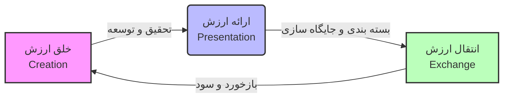
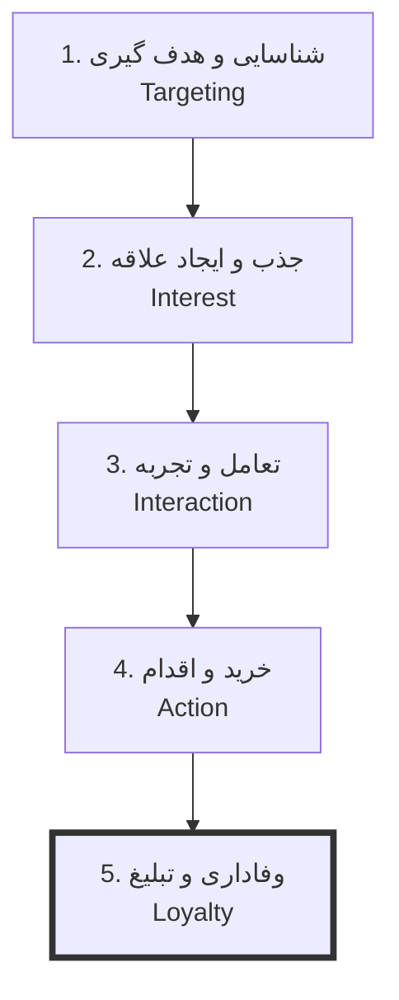

!!! abstract "شناسنامه درس"
    *   **:material-school: نام درس:** مدیریت بازاریابی
    *   **:material-calendar-clock: جلسه:** 01
    *   **:material-clock-outline:  زمان مورد نیاز مطالعه:** ۲۰ دقیقه
    *   **:material-rocket: هدف:** گذر از تعاریف تئوریک به سمت تدوین استراتژی و مدیریت اجرایی فرایندهای بازاریابی.

## :material-rocket: مقدمه و رویکرد آموزشی

مدیریت بازاریابی (Marketing Management) در دنیای امروز، فراتر از یک واحد سازمانی، قلب تپنده کسب‌وکارهای موفق است. رویکرد ما در این دوره، عبور از تعاریف خشک آکادمیک و ورود به دنیای واقعی استراتژی‌هاست. فلسفه این کلاس بر مبنای **تعامل (Interaction)** و تحلیل داده‌ها بنا شده است؛ جایی که تجربه مهندسی و نگاه سیستماتیک با هنر ارتباطات ترکیب می‌شود.

---

## ۱. تعریف جامع و مهندسی مارکتینگ

بسیاری واژه «مارکتینگ» را معادل «فروش» یا «تبلیغات» می‌دانند، اما این یک خطای استراتژیک است. برای درک عمیق، به تعریف **فیلیپ کاتلر** (پدر مارکتینگ نوین) رجوع می‌کنیم:

!!! quote "*فیلیپ کاتلر*"
    فعالیت هایی که در آن تلاش در ایجاد و حل حس **نیاز** باشد.

```اما این تعریف هنوز هم کامل نیست```

!!! tip "تعریف استاندارد مارکتینگ"
    مارکتینگ عبارت است از **علم و هنر** خلق، ارائه و انتقال **ارزش** به مخاطب هدف، به شرط سودآوری و جلب رضایت.

### ۱-۱. دو بال مارکتینگ: علم و هنر
مارکتینگ یک رشته تک‌بعدی نیست. مقایسه زیر ابعاد این دوگانگی را روشن می‌کند:

**مارکتینگ = خلاقیت + علم داده محور**

=== ":material-chart-bar: بُعد علمی (Science)"
    !!! pastel-green "رویکرد علمی: داده‌محور"
        مدیریت مدرن بدون داده، تنها یک حدس و گمان است. بخش علمی شامل مواردی مثل موارد زیر است:
        
        *   **داده‌کاوی (Data Mining):** تحلیل رفتار مشتریان.
        *   **تحقیقات بازار:** آمار و ارقام واقعی.
        *   **بودجه‌ریزی:** تخصیص دقیق منابع مالی.
        *   **تحلیل ریسک:** پیش‌بینی سناریوهای شکست.

=== ":material-palette: بُعد هنری (Art)"
    !!! pastel-pink "رویکرد هنری: خلاقیت‌محور"
        داده‌ها به تنهایی روح ندارند. بخش هنری وظیفه تزریق احساس را دارد، مثل:
        
        *   **خلاقیت (Creativity):** در طراحی محصول و تبلیغات.
        *   **داستان‌سرایی (Storytelling):** روایت برند.
        *   **ارتباط حسی:** درگیر کردن احساسات مشتری.
        *   **زیبایی‌شناسی:** طراحی بصری و بسته‌بندی.

### ۱-۲. فرمول حیاتی ارزش (Value)
قلب تپنده بازاریابی، خلق ارزش است. این مفهوم در فرمول زیر خلاصه می‌شود:

$$ Value -> Benefit > Cost $$

...

<!-- 
!!! warning "هزینه فقط پول نیست!"
    در فرمول بالا، $Cost$ (هزینه) شامل چهار مولفه است که مدیران اغلب از آن‌ها غافل می‌شوند:
    
    1.  **هزینه مالی:** پولی که مشتری می‌پردازد.
    2.  **هزینه زمانی:** وقتی که صرف جستجو و خرید می‌شود.
    3.  **هزینه انرژی:** تلاش فیزیکی برای دسترسی به کالا.
    4.  **هزینه روانی (Psychic Cost):** استرس و دغدغه ذهنی (مثلاً: "آیا این لباس به من می‌آید؟").

### ۱-۳. چرخه فرایند بازاریابی
بازاریابی یک فرایند خطی نیست، بلکه یک جریان است که می‌توان آن را به صورت زیر ترسیم کرد:



---

## ۲. تفاوت بنیادین فروش و بازاریابی

پیتر دراکر معتقد است: *«هدف بازاریابی این است که فروش را زائد کند.»* تفاوت این دو رویکرد را در تب‌های زیر مقایسه کنید:

=== ":material-cash: رویکرد فروش (Sales)"
    *   **تمرکز:** تبدیل کالا به پول نقد.
    *   **افق دید:** کوتاه‌مدت (امروز بفروش).
    *   **رویکرد:** تراکنشی (فقط امضا قرارداد مهم است).
    *   **استعاره:** چیدن میوه (Harvesting).
    *   **شروع:** از کارخانه و محصول موجود.

=== ":material-bullseye-arrow: رویکرد بازاریابی (Marketing)"
    *   **تمرکز:** برآوردن نیاز مشتری و خلق ارزش.
    *   **افق دید:** بلندمدت (مشتری وفادار بساز).
    *   **رویکرد:** ارتباطی (رابطه پس از خرید شروع می‌شود).
    *   **استعاره:** کاشت و داشت (Planting & Nurturing).
    *   **شروع:** از بازار و نیاز مشتری.

---

## ۳. سفر مشتری و قیف بازاریابی مدرن

مشتری یک‌شبه خریدار نمی‌شود. او مسیری ۵ مرحله‌ای را طی می‌کند. در مدیریت کلان، تمرکز نباید فقط روی مرحله خرید باشد.



!!! tip "نکته مدیریتی: ریزفروشی vs مدیریت"
    در کسب‌وکارهای کوچک، تمرکز اغلب روی مرحله ۴ (خرید لحظه‌ای) است. اما هنر مدیریت بازاریابی، سرمایه‌گذاری روی **مرحله ۵ (وفاداری)** است، جایی که مشتری تبدیل به وکیل مدافع برند شما می‌شود.

---

## ۴. سیر تحول پارادایم‌های بازاریابی

درک تاریخچه به ما کمک می‌کند تا اشتباهات گذشته را تکرار نکنیم.

| دوره زمانی | نام عصر | شعار و تفکر غالب |
| :--- | :--- | :--- |
| قرن ۱۹ تا ۲۰ | **عصر تولید** | "محصول خوب خودش را می‌فروشد." (تمرکز بر کارایی تولید) |
| اوایل قرن ۲۰ | **عصر فروش** | "مشتری را باید به خرید مجبور کرد." (فشار و تبلیغات اغراق‌آمیز) |
| ۱۹۵۰ به بعد | **عصر بازاریابی** | "آنچه مشتری می‌خواهد بساز." (شروع با نیازسنجی) |

### مفاهیم کلیدی: نیاز، خواسته، تقاضا

!!! failure "اشتباه رایج: نزدیک‌بینی بازاریابی"
    بسیاری از استارتاپ‌ها شکست می‌خورند چون روی «محصول» (خواسته) تمرکز می‌کنند نه «راه‌حل» (نیاز).
    *   **نیاز (Need):** حس کمبود (تشنه بودن).
    *   **خواسته (Want):** شکل فرهنگی رفع نیاز (نوشابه کوکاکولا).
    *   **تقاضا (Demand):** خواسته + قدرت خرید.

$$ Demand = Want + Buying Power $$

---

## ۵. استراتژی STP و ساختار دپارتمان بازاریابی

برای موفقیت، باید بازار را مهندسی کنید. این فرایند در مدل **STP** خلاصه می‌شود:

1.  :material-scissors-cutting: **بخش‌بندی (Segmentation):** تقسیم بازار بر اساس جغرافیا، دموگرافیک، یا سبک زندگی (Psychographic).
2.  :material-target: **هدف‌گیری (Targeting):** انتخاب جذاب‌ترین بخش بازار.
3.  :material-flag: **جایگاه‌سازی (Positioning):** تصویری که در ذهن آن بخش می‌سازید.

### ارکان پنج‌گانه دپارتمان بازاریابی
یک دپارتمان کامل فراتر از فروش است و باید شامل ۵ رکن زیر باشد:

*   :material-magnify: **تحقیقات بازار:** رصد رقبا و ترندها.
*   :material-bullhorn: **تبلیغات و محتوا:** ویترین سازمان.
*   :material-tag-text: **استراتژی قیمت‌گذاری:** تعیین ارزش درک شده.
*   :material-face-agent: **خدمات و پشتیبانی:** مدیریت رضایت.
*   :material-account-group: **روابط عمومی (PR):** مدیریت برند و بحران.

---

## ۶. آینده بازاریابی و هوش مصنوعی :material-robot:

!!! info "هوش مصنوعی: تهدید یا فرصت؟"
    هوش مصنوعی جایگزین مدیران بازاریابی نخواهد شد، اما **مدیرانی که از AI استفاده می‌کنند، جایگزین مدیرانی می‌شوند که از آن استفاده نمی‌کنند.**

*   **پیش‌بینی رفتار:** استفاده از Big Data برای حدس زدن نیاز مشتری قبل از خودش (مثل فروشگاه‌های Target).
*   **شخصی‌سازی (Hyper-Personalization):** ارائه پیشنهاد اختصاصی به هر نفر (مثل Netflix).

---

## :material-check-all: جمع‌بندی و اقدام

در پایان این فصل، ما دریافتیم که مدیریت بازاریابی یعنی مدیریت فرایند خلق ارزش. ما از عصر "فشار فروش" عبور کرده‌ایم و در عصر "ارتباط و وفاداری" هستیم.

!!! success "خلاصه مدیریتی"
    *   بازاریابی از **بازار** شروع می‌شود، نه از کارخانه.
    *   هزینه جذب مشتری جدید **۵ تا ۷ برابر** حفظ مشتری فعلی است.
    *   هدف نهایی، تبدیل "تقاضا" به "وفاداری" است.

!!! tip "تمرین‌های عملی (Action Items)"
    برای تسلط بر مباحث این فصل، ۳ تمرین زیر را انجام دهید:
    
    1.  **بخش‌بندی سایکوگرافیک:** مشتریان کسب‌وکار خود را نه بر اساس سن/جنسیت، بلکه بر اساس "سبک زندگی" و "ارزش‌ها" دسته‌بندی کنید.
    2.  **ارزیابی ارکان:** به ۵ رکن دپارتمان بازاریابی خود نمره دهید (تحقیقات، محتوا، قیمت، خدمات، PR). کدام بخش پاشنه آشیل شماست؟
    3.  **تحلیل ارزش:** برای یکی از محصولات خود فرمول $Value = Benefit - Cost$ را بنویسید و ۳ راهکار برای کاهش "هزینه روانی" مشتری پیدا کنید. -->